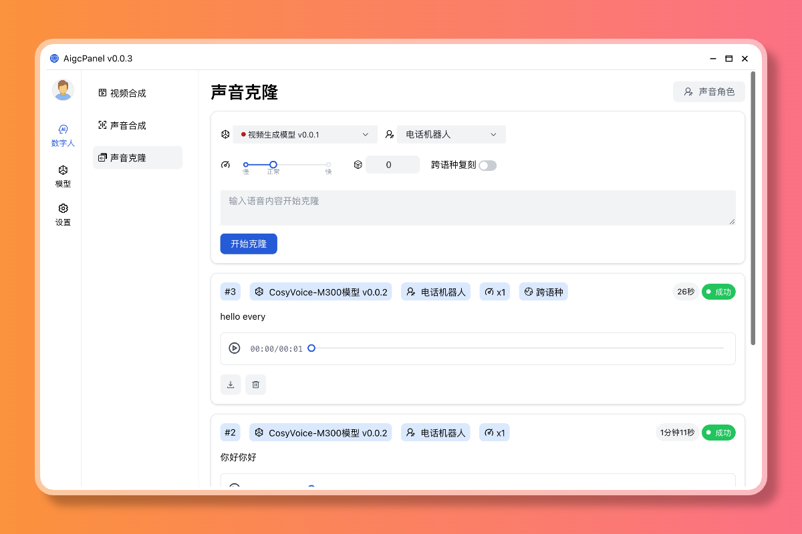
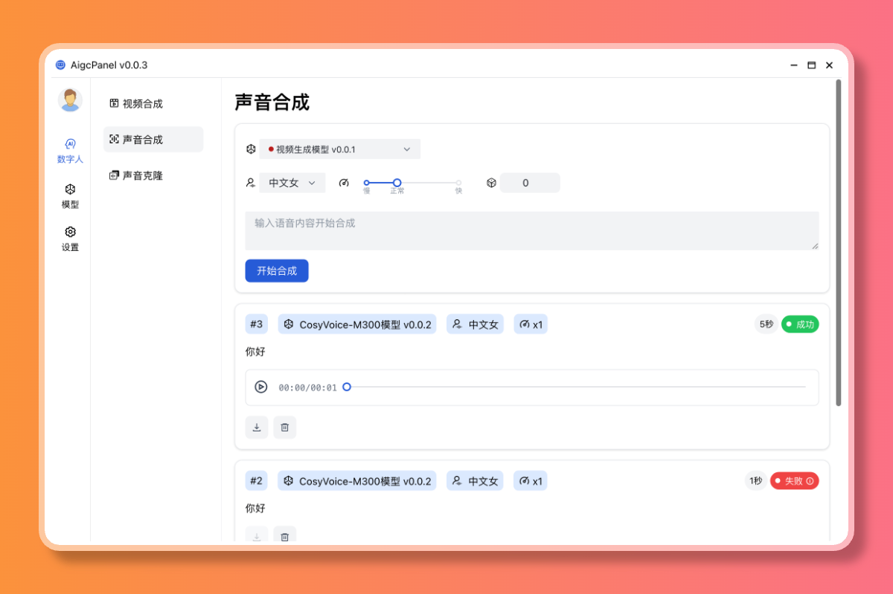
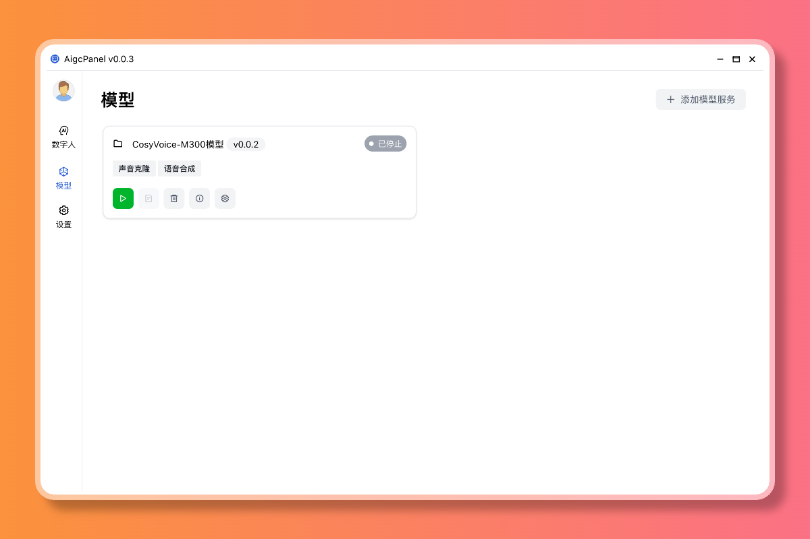
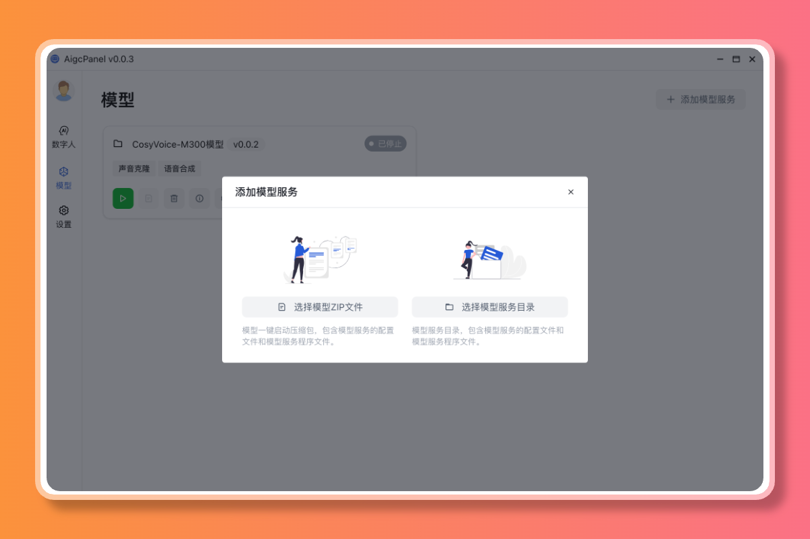

# AigcPanel


## 软件介绍

`AigcPanel` 是一个简单易用的一站式AI数字人系统，小白也可使用。
支持视频合成、声音合成、声音克隆，简化本地模型管理、一键导入和使用AI模型。

> 禁止使用本产品进行违法违规业务，使用本软件请遵守中华人民共和国法律法规。

## 功能特性

- 支持视频数字人合成，支持视频画面和声音换口型匹配
- 支持语音合成、语音克隆，多种声音参数可设置
- 支持多模型导入、一键启动、模型设置、模型日志查看
- 支持国际化，支持简体中文、英语
- 支持多种模型一键启动包：`MuseTalk`、`cosyvoice`

## 效果预览

参考 [demo](demo/) 中的视频文件。

## 功能预览

### 视频合成


### 语音克隆



### 语音合成



### 模型管理



### 模型添加



### 模型日志


### 关于


## 安装使用

### Windows

- 访问 [https://aigcpanel.com](https://aigcpanel.com) 下载 Windows 安装包，一键安装即可

安装完成后，打开软件，下载模型一键启动包，即可使用。

## 模型自定义接入

如果有第三方一键启动的模型，可以按照以下方式接入。

模型文件夹格式，只需要编写 `config.json` 和 `server.js` 两个文件即可。

```
|- 模型文件夹/
|-|- config.json - 模型配置文件
|-|- server.js   - 模型对接文件
|-|- xxx       - 其他模型文件，推荐将模型文件放在 model 文件夹下
```

### config.json 文件示例

```json5
{
    "name": "server-xxx",      // 模型名称
    "version": "0.1.0",        // 模型版本
    "title": "语音模型",        // 模型标题
    "description": "模型描述",  // 模型描述
    "platformName": "win",     // 支持系统，win, osx, linux
    "platformArch": "x86",     // 支持架构，x86, arm64
    "entry": "server/main",    // 入口文件，一键启动包文件
    "functions": [
        "videoGen",            // 支持视频生成
        "soundTTS",            // 支持语音合成
        "soundClone"           // 支持语音克隆
    ],
    "settings": [              // 模型配置项，可以显示在模型配置页面
        {
            "name": "port",
            "type": "text",
            "title": "服务端口",
            "default": "",
            "placeholder": "留空会检测使用随机端口"
        }
    ]
}
```

### server.js 文件示例

> 以下以 MuseTalk 为例

```js
const serverRuntime = {
    port: 0,
}

let shellController = null

module.exports = {
    ServerApi: null,
    _url() {
        return `http://localhost:${serverRuntime.port}/`
    },
    async _client() {
        return await this.ServerApi.GradioClient.connect(this._url());
    },
    _send(serverInfo, type, data) {
        this.ServerApi.event.sendChannel(serverInfo.eventChannelName, {type, data})
    },

    // 模型初始化
    async init(ServerApi) {
        this.ServerApi = ServerApi;
    },
    // 模型启动
    async start(serverInfo) {
        console.log('start', JSON.stringify(serverInfo))
        this._send(serverInfo, 'starting', serverInfo)
        let command = []
        if (serverInfo.setting?.['port']) {
            serverRuntime.port = serverInfo.setting.port
        } else if (!serverRuntime.port || !await this.ServerApi.app.isPortAvailable(serverRuntime.port)) {
            serverRuntime.port = await this.ServerApi.app.availablePort(50617)
        }
        if (serverInfo.setting?.['startCommand']) {
            command.push(serverInfo.setting.startCommand)
        } else {
            //command.push(`"${serverInfo.localPath}/server/main"`)
            command.push(`"${serverInfo.localPath}/server/.ai/python.exe"`)
            command.push('-u')
            command.push(`"${serverInfo.localPath}/server/run.py"`)
            if (serverInfo.setting?.['gpuMode'] === 'cpu') {
                command.push('--gpu_mode=cpu')
            }
        }
        shellController = await this.ServerApi.app.spawnShell(command, {
            cwd: `${serverInfo.localPath}/server`,
            env: {
                GRADIO_SERVER_PORT: serverRuntime.port,
                PATH: [
                    process.env.PATH,
                    `${serverInfo.localPath}/server`,
                    `${serverInfo.localPath}/server/.ai/ffmpeg/bin`,
                ].join(';')
            },
            stdout: (data) => {
                this.ServerApi.file.appendText(serverInfo.logFile, data)
            },
            stderr: (data) => {
                this.ServerApi.file.appendText(serverInfo.logFile, data)
            },
            success: (data) => {
                this._send(serverInfo, 'success', serverInfo)
            },
            error: (data, code) => {
                this.ServerApi.file.appendText(serverInfo.logFile, data)
                this._send(serverInfo, 'error', serverInfo)
            },
        })
    },
    // 模型启动检测
    async ping(serverInfo) {
        try {
            const res = await this.ServerApi.request(`${this._url()}info`)
            return true
        } catch (e) {
        }
        return false
    },
    // 模型停止
    async stop(serverInfo) {
        this._send(serverInfo, 'stopping', serverInfo)
        try {
            shellController.stop()
            shellController = null
        } catch (e) {
            console.log('stop error', e)
        }
        this._send(serverInfo, 'stopped', serverInfo)
    },
    // 模型配置
    async config() {
        return {
            "code": 0,
            "msg": "ok",
            "data": {
                "httpUrl": shellController ? this._url() : null,
                "functions": {
                    "videoGen": {
                        "param": [
                            {
                                name: "box",
                                type: "inputNumber",
                                title: "嘴巴张开度",
                                defaultValue: -7,
                                placeholder: "",
                                tips: '嘴巴张开度可以控制生成视频中嘴巴的张开程度',
                                min: -9,
                                max: 9,
                                step: 1,
                            }
                        ]
                    },
                }
            }
        }
    },
    // 视频生成
    async videoGen(serverInfo, data) {
        console.log('videoGen', serverInfo, data)
        const client = await this._client()
        const resultData = {
            // success, querying, retry
            type: 'success',
            start: 0,
            end: 0,
            jobId: '',
            data: {
                filePath: null
            }
        }
        resultData.start = Date.now()
        const result = await client.predict("/predict", [
            this.ServerApi.GradioHandleFile(data.videoFile),
            this.ServerApi.GradioHandleFile(data.soundFile),
            parseInt(data.param.box)
        ]);
        // console.log('videoGen.result', JSON.stringify(result))
        resultData.end = Date.now()
        resultData.data.filePath = result.data[0].value.video.path
        return {
            code: 0,
            msg: 'ok',
            data: resultData
        }
    },
}
```

## 技术栈

- `electron`
- `vue3`
- `typescript`

## 本地运行开发

> 仅在 node 20 测试过

```shell
# 安装依赖
npm install
# 调试运行
npm run dev
# 打包
npm run build
```

## 加入交流群

<table width="100%">
    <thead>
        <tr>
            <th width="50%">微信群</th>
            <th>QQ群</th>
        </tr>
    </thead>
    <tbody>
        <tr>
            <td>
                
            </td>
            <td>
                
            </td>
        </tr>
    </tbody>
</table>

## 本程序中使用到了以下开源项目，特此感谢

- [CosyVoice](https://github.com/FunAudioLLM/CosyVoice)
- [MuseTalk](https://github.com/TMElyralab/MuseTalk)

## License

AGPL-3.0
